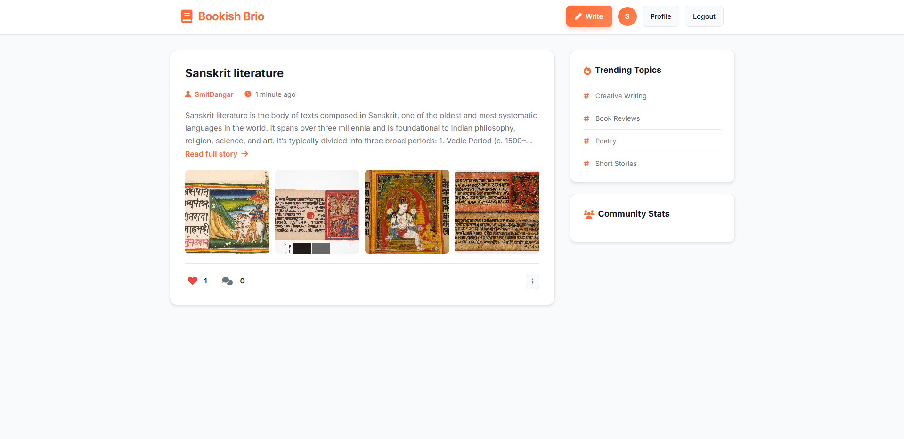
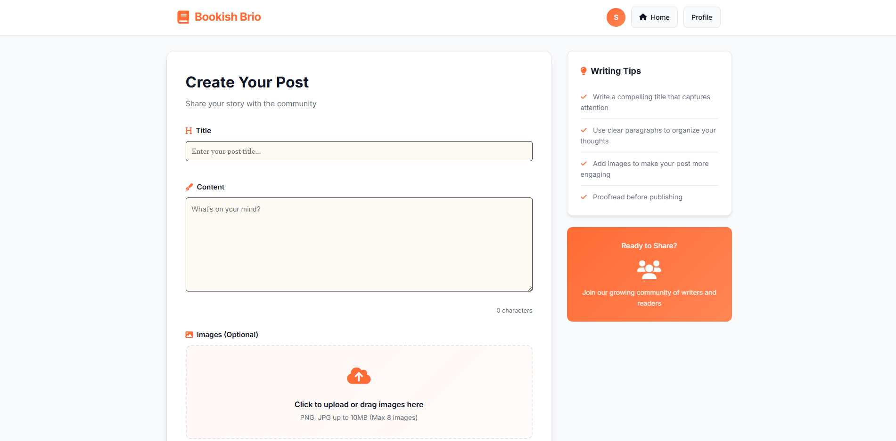
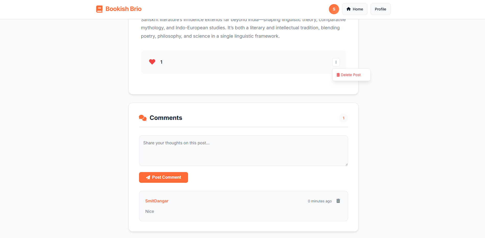

# Bookish Brio

A clean, modern blogging platform for writers and readers to share stories and connect.



## Features

- **Create & Share**: Write posts with rich text and images
- **Engage**: Like posts and comment on stories
- **Connect**: Build a community of writers and readers
- **User Profiles**: Track your posts and activity

## Screenshots

### Create Posts


### Post Details & Comments




### User Profile


## Tech Stack

- Django 5.2.6
- SQLite database
- Whitenoise for static files
- Gunicorn for deployment

## Quick Start

```bash
# Clone repository
git clone https://github.com/SmitBdangar/Bookish-Brio.git
cd Bookish-Brio

# Install dependencies
pip install -r requirements.txt

# Run migrations
python manage.py migrate

# Create superuser (optional)
python manage.py createsuperuser

# Start server
python manage.py runserver
```

Visit `http://localhost:8000`

## Deployment

Configured for Railway deployment with Procfile and runtime.txt included.

## License

Open source project - feel free to use and modify.
